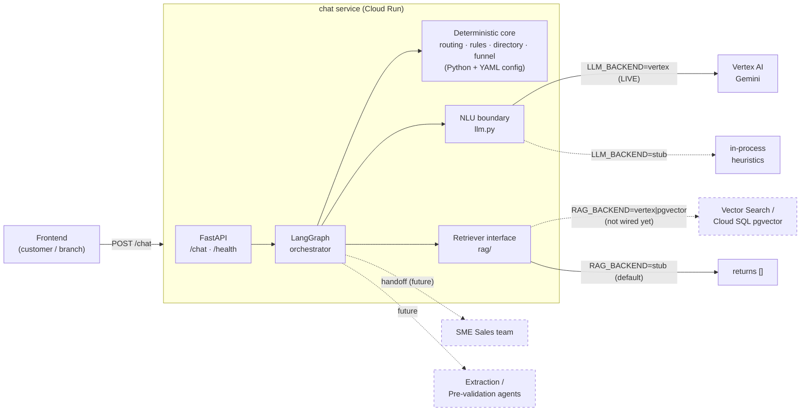
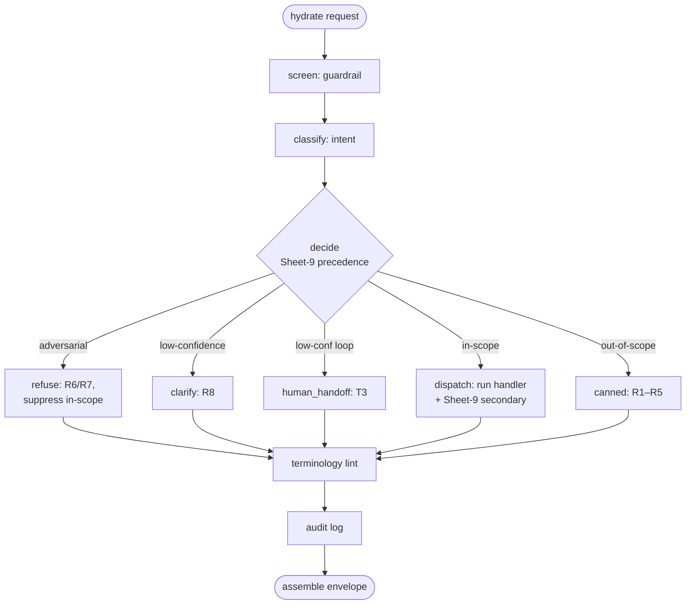
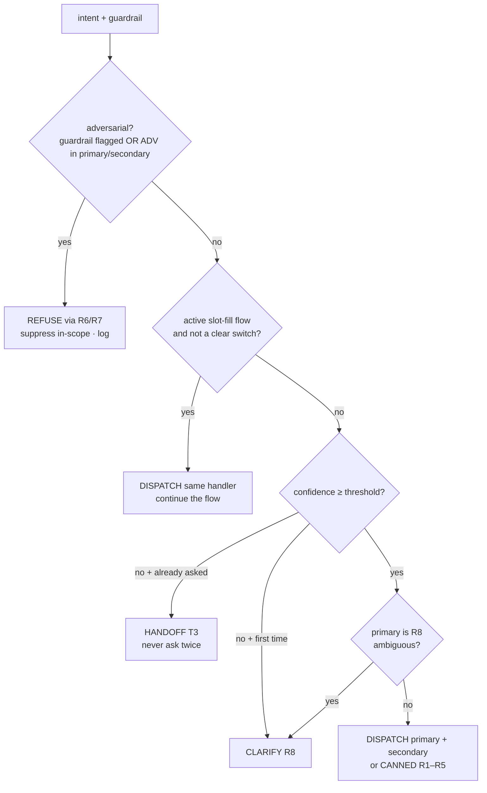
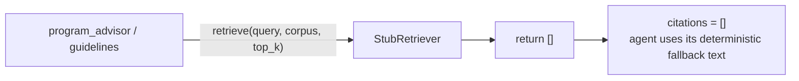
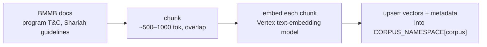
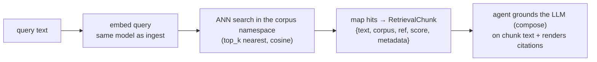
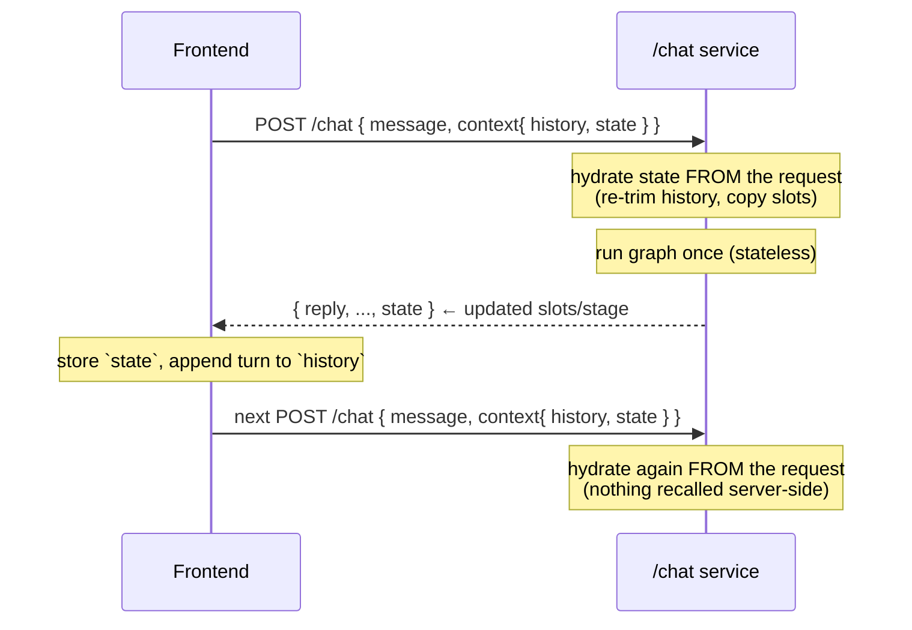

# Customer Service Agent — Architecture & End-to-End Flow

A single, complete walkthrough of the `/chat` service: from the 30,000-ft view down to
what every node does on one request, how RAG is meant to work (and what actually runs
today), where data lives (spoiler: the server keeps **nothing** by default), and what is
still **not** covered.

- [1. High level](#1-high-level)
- [2. System context](#2-system-context)
- [3. End-to-end: one `/chat` request](#3-end-to-end-one-chat-request)
- [4. Component deep dive](#4-component-deep-dive)
- [5. RAG — how it works, tools, method, processing](#5-rag--how-it-works-tools-method-processing)
- [6. Data & persistence — what is saved (nothing, by default)](#6-data--persistence--what-is-saved-nothing-by-default)
- [7. What is NOT covered yet](#7-what-is-not-covered-yet)
- [8. Backend / config reference](#8-backend--config-reference)

---

## 1. High level

The service is the **conversational front door** for BMMB SME financing. One customer (or
branch agent) utterance comes in; the service classifies it, answers if it's in-scope,
runs a light **indicative** eligibility pre-check, or hands off to a human — and returns a
structured envelope the frontend renders.

The workload is deliberately **~80% deterministic** (routing tables, thresholds,
eligibility rules — plain Python + YAML) and **~20% NLU** (intent classification,
adversarial detection, slot extraction, phrasing — a Gemini call). The LLM is boxed into
those four narrow tasks; it **never** routes, decides eligibility, or approves anything.

> **Status (2026-07-28) — NLU is now LIVE on Vertex.** The service is wired to real Gemini
> — same GCP project as the extraction service (`prototype-bmmb-1b62`, `asia-southeast1`,
> `gemini-2.5-flash`, ADC auth, no API keys) — and validated:
> - **Intent classifier**: enum-constrained output + a richer prompt (confidence rubric,
>   edge-case rules, curated few-shot) → **86% exact / 90% type-level** on the Sheet-1.2
>   bank; at threshold 0.7 only 1/42 goes to clarification.
> - **Guardrail LLM stage**: rubric + few-shot + enum, red-teamed — catches subtle,
>   denylist-evading attacks and no longer false-flags bare criterion questions.
>
> It still runs **fully offline on the stub** when `GCP_PROJECT_ID` is unset, so the tests
> and a no-creds run are unaffected.

```
Customer / Branch UI
        │  POST /chat  { message, channel, application_id, context{history, state} }
        ▼
┌─────────────────────────────────────────────────────────────────────┐
│  /chat service  (FastAPI + LangGraph)                                │
│                                                                       │
│   guardrail ─► classify ─► decide ─► {refuse│clarify│handoff│         │
│                                        dispatch│canned}               │
│                              │                                        │
│                              ▼        deterministic core (Python+YAML)│
│                        eligibility rules · routing · directory · funnel│
│                              │                                        │
│                              ▼        narrow NLU (Vertex Gemini | stub)│
│                        classify · guard · extract · phrase            │
│                              │                                        │
│                              ▼        RAG (Retriever interface → stub) │
│                        program / guidelines corpora                   │
│                                                                       │
│   terminology-lint ─► audit ─► assemble envelope                      │
└─────────────────────────────────────────────────────────────────────┘
        │  { reply, intent, ui_action, citations, handoff, state, audit }
        ▼
Customer / Branch UI   (echoes `state` back next turn)
```

**Two backend switches make the whole thing runnable with zero credentials** and flip to
real GCP with one env var each:

- `LLM_BACKEND = stub | vertex` — deterministic heuristics vs. real Gemini.
- `RAG_BACKEND = stub | vertex | pgvector` — empty typed results vs. a real vector store.

---

## 2. System context



Solid = live today (Vertex Gemini is now wired). Dashed = planned / not-yet-wired.

---

## 3. End-to-end: one `/chat` request

Memory is **client-supplied**: the frontend sends recent turns in `context.history` and the
slots/stage the server returned last turn in `context.state`. The server hydrates fresh
from that, runs **one pass** of the graph, and echoes the updated `state` back. By default
it persists nothing (see §6).

### 3.1 The graph



### 3.2 Step by step (what actually happens)

| # | Stage | What happens | Deterministic? |
|---|-------|--------------|----------------|
| 0 | **Hydrate** (`graph._hydrate`) | Build `SessionState` from the request. Server **re-trims** `history` to `HISTORY_MAX_TURNS`/`HISTORY_MAX_CHARS` (never trusts the client to bound it). Copies `context.state.collected_slots` into `slots` as an *untrusted convenience cache*. Mints `session_id` + `trace_id`. | ✅ |
| 1 | **screen** (`guardrail`) | Runs on the **current message only**, every turn. Stage 1 = deterministic denylist (regex for injection/extraction/exfil/encoding). Stage 2 = LLM adversarial classifier (ADV-01…08). A hit in either flags the turn. | denylist ✅ / LLM stage 🤖 |
| 2 | **classify** (`intent_classifier`) | Gemini (or stub) returns `{primary, confidence, secondary}` using the taxonomy from `intents.yaml`. Hallucinated labels are rejected → low confidence. | 🤖 |
| 3 | **decide** (`routing.decide`) | **Pure function.** Applies Sheet-9 precedence: (1) adversarial → refuse + suppress; (1.5) active-flow continuation; (2) confidence gate; (3) intent-driven clarification; (4) secondary handling; (5) dispatch. Returns a `RoutingDecision`. | ✅ |
| 4 | **one terminal node** | `refuse` / `clarify` / `human_handoff` / `dispatch` / `canned` — see §4. `dispatch` runs the in-scope handler and folds in the Sheet-9 secondary (append redirect / append clarify / run a 2nd handler). | mixed |
| 5 | **terminology** | Lints the composed reply: rewrites any `loan`→`financing`, `interest rate`→`profit rate` (case-preserving) and records violations. The bot's own output can never emit forbidden terms. | ✅ |
| 6 | **audit** | Writes one append-only, **PII-redacted** record (trace_id, route, rule_version, guardrail verdict, decision outcomes, timestamp). Default writer = in-RAM (see §6). | ✅ |
| 7 | **assemble** (`graph._assemble`) | Builds the `ChatResponse` envelope. `decision_inputs` are re-redacted defensively. Returns `state` for the client to echo next turn. | ✅ |

### 3.3 Sheet-9 precedence (the heart of routing)



The **secondary** (Sheet 9.1) is folded into whatever the primary produced:
`in + out` → answer + append the redirect; `in + in` → run both handlers;
`in + unclear` → answer + append R8; `* + adversarial` → refuse only (in-scope suppressed).

---

## 4. Component deep dive

Directory: `app/agents/` (one job each), `app/orchestrator/` (flow only), `app/config/` +
`app/prompts/` (content only).

- **Guardrail** (`agents/guardrail/`) — `denylist.py` is a list of compiled regexes mapped to
  ADV categories; `guardrail.py` runs it first, then the LLM classifier (enum-constrained to
  the ADV set, prompt with a criteria-vs-gaming rule + few-shot). Emits `{flagged, category}`;
  the detection reasoning is never surfaced. **Security control** — runs every turn, never on
  client history. *Validated: catches subtle denylist-evading attacks; no false-flag on bare
  criterion questions.*
- **Intent classifier** (`agents/intent_classifier/`) — thin wrapper over the LLM; the Vertex
  schema `enum`-constrains `primary`/`secondary` to real cat_ids (can't hallucinate a label),
  and the prompt carries a confidence rubric + curated few-shot. Validates + clamps in code.
  Makes no routing call. *Validated: 86% exact / 90% type-level on the Sheet-1.2 bank.*
- **Routing** (`orchestrator/routing.py`) — the pure Sheet-9 engine + the `ROUTE-* → node`
  table + active-flow continuation. Fully unit-tested.
- **Eligibility** (`agents/eligibility/`) — **two tiers**:
  - `rules.py` is a **pure, deterministic** function over the 6 Tier-1 thresholds
    (`eligibility_rules.yaml`): business age ≥ 3y, equity ≥ 0, revenue ≥ 0, working-capital
    ≤ 30% of revenue, end-balance ≥ 0, staff ≥ 5. Verdict ∈ `INDICATIVE_ELIGIBLE` /
    `INDICATIVE_NOT_ELIGIBLE` / `REFER_TO_SALES` / `INCOMPLETE`. **The LLM never decides.**
  - `agent.py` detects Tier-2 topics (EBIT, CTOS, CCRIS, DSCR…) → hands off to Sales; else
    extracts slots via the LLM, merges with the running slots, calls `rules.py`, and phrases
    a **deterministic** verdict + indicative-only disclaimer (kept off the LLM on purpose so
    the disclaimer is verbatim/reviewable).
- **Program advisor** (`agents/program_advisor/`) — the Sheet-3 funnel: collects purpose +
  amount across turns, filters programs whose `[min,max]` quantum range contains the amount
  (`products.yaml`), re-orders by a purpose-affinity map, enriches via the Retriever, phrases
  the result. Product **selection is deterministic**; only phrasing is LLM.
- **Sales handoff** (`agents/sales_handoff/`) — resolves state/city → region → contact from
  `sales_directory.yaml` (unresolvable → Overall/R1), detects T1–T4 triggers, emits the
  H1–H4 message + a contact card.
- **Application** (`agents/application/`) — `initiate.py` (Sheet 6) emits an
  `open_application_link` action (placeholder URL); `lookup.py` (Sheets 7/8, **placeholder**)
  stubs the stage→redirect for continue/track and demands `application_id` first.
- **Guidelines** (`agents/guidelines/`) — RAG over the Shariah/guidelines corpus (empty →
  safe deterministic fallback today).
- **Cross-cutting** (`utils/`) — `terminology.py` (financing/profit-rate lint),
  `pii.py` (redaction), `logging.py`, `prompts.py` (loads versioned `.md` prompts).

---

## 5. RAG — how it works, tools, method, processing

> **Read this first:** RAG is a **placeholder today**. No embeddings are computed, no vector
> store is queried, no documents are chunked, and **zero citations are produced**. The
> `StubRetriever` returns a typed empty list. What *is* built is the **boundary** — a frozen
> interface and injection wiring — so a real backend drops in by flipping one env flag with
> no changes to any agent, node, prompt, or schema (brief §11.1). Corpora are empty because
> the source docs are pending (Sheet 4 Shariah guidelines; program T&C).

### 5.1 The frozen interface

```python
# app/agents/rag/retriever.py
class Corpus(str, Enum):
    PROGRAM = "program"                 # Sheet 3.1–3.3 program knowledge / T&C / FAQ
    GUIDELINES_SHARIAH = "guidelines_shariah"   # Sheet 4 (pending BMMB docs)
    SALES_DIR = "sales_dir"             # Sheet 2 directory (structured; RAG optional)

@dataclass
class RetrievalChunk:
    text: str; corpus: str; ref: str; score: float; metadata: dict

class Retriever(ABC):
    def retrieve(self, query: str, corpus: Corpus, top_k: int = 5) -> list[RetrievalChunk]: ...
```

Three **separate corpora** (namespaces), never mixed. Consumers depend **only** on this
interface and render `citations` straight from `RetrievalChunk`.

### 5.2 What runs today (read-path)



`StubRetriever.retrieve()` = `return []`. Program advisor still recommends products
(deterministic funnel); guidelines returns a safe generic answer. Nothing is embedded,
searched, or stored.

### 5.3 What runs when wired (the intended method)

Two independent paths behind the same interface:

**Write-path / ingestion** (`rag/ingest.py`, stub today):


**Read-path / retrieval** (the real `retrieve()` body):


Processing inside a real `retrieve(query, corpus, top_k)`:
1. **Embed** the query with the same Vertex embedding model used at ingest (e.g.
   `text-embedding-004` / a Gemini embedding model) → a query vector.
2. **ANN search** (approximate nearest neighbour, cosine similarity) against the index for
   **that corpus's namespace only** — corpora never bleed into each other.
3. **Top-k** hits → each mapped to a `RetrievalChunk` with the source `ref` (doc + section)
   and `score`.
4. The **agent** passes chunk text into the LLM `compose()` call as grounding context and
   renders `citations` from the chunks. The LLM answers *from* the chunks, not from memory.

**Tools (planned, not yet active):**
- **Vector store:** Vertex AI **Vector Search** *or* Cloud SQL **pgvector**
  (`integrations/vector_search.py` has both stubs: `VertexVectorSearchRetriever`,
  `PgVectorRetriever`).
- **Embeddings + generation:** Vertex AI (Gemini) via `google-genai`.
- **Namespaces:** `rag/corpora.py` `CORPUS_NAMESPACE` maps each `Corpus` to an index name.

### 5.4 The swap (one file + one flag)

```python
# rag/corpora.py — factory picks the impl from settings; main.py injects it into agents
RAG_BACKEND=stub      -> StubRetriever()                    # today
RAG_BACKEND=vertex    -> VertexVectorSearchRetriever(...)   # implement retrieve(), add index
RAG_BACKEND=pgvector  -> PgVectorRetriever(...)             # implement retrieve(), add table
```

Because agents receive a `Retriever` and never construct a backend, enabling real RAG is:
implement the class body, point the namespace at a real index, set `RAG_BACKEND`. No
orchestrator/agent/prompt/schema edits. If you ever find yourself editing an agent to turn
on RAG, the interface was drawn in the wrong place.

---

## 6. Data & persistence — what is saved (nothing, by default)

**Short answer: the service persists nothing. No files, no database, no object storage.**
You're right that it isn't really "short memory" — the memory of record is the `context`
*you* send each request; the server hydrates from it, runs once, and hands it back.

### 6.1 The memory model



The client is the single source of truth. Two different requests with the **same
`session_id`** but different `context` are fully independent — verified: no slot bleeds
across requests.

### 6.2 Every place data could live, and what actually happens

| Location | What's there | Persisted? |
|----------|--------------|-----------|
| **Client `context`** | history + slots/stage | Held by the **frontend**, not the server. Sent each request. |
| **Per-request `SessionState`** | the working state for one turn | RAM only, **garbage-collected when the request returns**. |
| **LangGraph checkpointer** | conversation state keyed by session_id | **`SESSION_STORE_BACKEND=none` (default) → not created.** Server keeps nothing between requests. (`memory` = RAM only, lost on restart; `postgres` = future durability, opt-in.) |
| **Audit writer** | one record/turn: trace_id, route, rule_version, guardrail verdict, **rule outcomes** | **RAM only** (default `memory`), append-only, lost on restart, **never written to disk/DB**. **Redacted** — no raw message, no PII, no financial figures (only `{rule: pass/fail}`). Set `AUDIT_BACKEND=none` for zero retention (drops the BNM compliance trail). |
| **Config/prompt caches** | `intents.yaml`, prompts, etc. | Config files only (not user data). |
| **Logs (stdout)** | warnings (e.g. Vertex fallback) | No user message or PII is logged; raw prompts are never logged (§2.5). |
| **Disk / Cloud SQL / Cloud Storage** | — | **Nothing is written.** The Cloud SQL/audit/vector-store integrations are stubs/off. |

### 6.3 The one egress point to be aware of

- **`LLM_BACKEND=stub` (default): nothing leaves the process.** All NLU is in-memory
  heuristics. Fully self-contained, zero network.
- **`LLM_BACKEND=vertex`: the message text is sent to Google's Vertex AI** for
  classification / extraction / phrasing — that's inherent to using a hosted LLM. Our
  service still stores nothing, and PII is redacted before any local log, but the utterance
  does transit to Vertex under your GCP project. In stub mode there is no such egress.

**Net:** with the defaults (`SESSION_STORE_BACKEND=none`, stub backends), the service is
**stateless and self-contained** — it remembers nothing after a response is sent, and
nothing is written anywhere. The only in-RAM retention is the redacted audit trail, which
you can turn off entirely.

---

## 7. What is NOT covered yet

**Placeholders (built behind real interfaces — swap-in is trivial):**
- **RAG retrieval** — stub returns `[]`; no embeddings/vector store/chunking runs. Corpora
  empty (Sheet 4 Shariah docs + program T&C pending). §5.
- **Continue / Track application** (`application/lookup.py`, Sheets 7/8) — stage values and
  page URLs are stubbed; real stage must be resolved **server-side** by `application_id`.
- **New-application URL** — placeholder constant.
- **Cloud SQL checkpointer + audit** — in-RAM stubs; append-only table not provisioned.

> **Now DONE (no longer a placeholder):** Vertex Gemini is wired and validated for all four
> NLU tasks (classify, guardrail, extract, phrase). RAG is the main remaining placeholder.

**Not in scope of this build / deferred:**
- **Downstream agent handoff** to the Extraction / Pre-validation services (the brief names
  them; the wiring/contract is future work).
- **AuthN/AuthZ, RBAC, rate limiting, request signing** — the service trusts its caller;
  channel is a hint, not an authorization. (SOW #5 RBAC is separate.)
- **Streaming responses**, retries/backoff tuning, and observability/tracing export.
- **Tier-2 eligibility** — intentionally excluded (EBIT/CTOS/CCRIS/DSCR/gearing/AMLA…) →
  always routed to Sales; the bot must never attempt these.
- **Classifier tuning at scale** — real Gemini already scores 86%/90% on the 42-row
  Sheet-1.2 bank at threshold 0.7; a larger labelled eval set is still needed to lock the
  threshold for SIT (notebook Part C is the harness).
- **Security testing** — a third party tests it; the service does not self-certify.
- **Multilingual depth** — code-switching (BM/English) is handled at the taxonomy level, but
  there's no full localization of canned wording yet.

---

## 8. Backend / config reference

| Env | Default | Options | Effect |
|-----|---------|---------|--------|
| `LLM_BACKEND` | `stub`* | `stub`, `vertex` | NLU: deterministic heuristics vs. real Gemini. |
| `RAG_BACKEND` | `stub` | `stub`, `vertex`, `pgvector` | Retrieval: `[]` vs. a real vector store. |
| `SESSION_STORE_BACKEND` | `none` | `none`, `memory`, `postgres` | **`none` = fully stateless.** |
| `AUDIT_BACKEND` | `memory` | `none`, `memory`, `cloudsql` | `memory` = redacted records in RAM; `none` = zero retention. |
| `CONFIDENCE_THRESHOLD` | `0.7` | float | Below this → clarify (Sheet 9.4). |
| `HISTORY_MAX_TURNS` / `_CHARS` | `10` / `6000` | int | Server-side defensive re-trim of client history. |
| `GCP_PROJECT_ID`, `VERTEX_LOCATION`, `MODEL_ID` | — / `asia-southeast1` / `gemini-2.5-flash` | | Vertex config (ADC auth, no API keys). |

\* `LLM_BACKEND` auto-selects `vertex` when `GCP_PROJECT_ID` is set, else `stub`. The dev
`.env` in the service root points at Vertex (`prototype-bmmb-1b62`) — remove it or set
`LLM_BACKEND=stub` to run fully offline. `google-genai==0.3.0` (same as extraction) is
required for the Vertex path; the stub path needs none of the GCP packages.

**Content lives in config, never code:** `intents.yaml` (taxonomy — the router and
classifier both read it), `responses.yaml` (R1–R8 wording), `eligibility_rules.yaml`
(Tier-1 thresholds + rule_version), `products.yaml` (quantum table + funnel),
`sales_directory.yaml` (geo + directory). Prompts live in `prompts/*.md`. Editing any of
these re-scopes behaviour with **zero code changes**.
