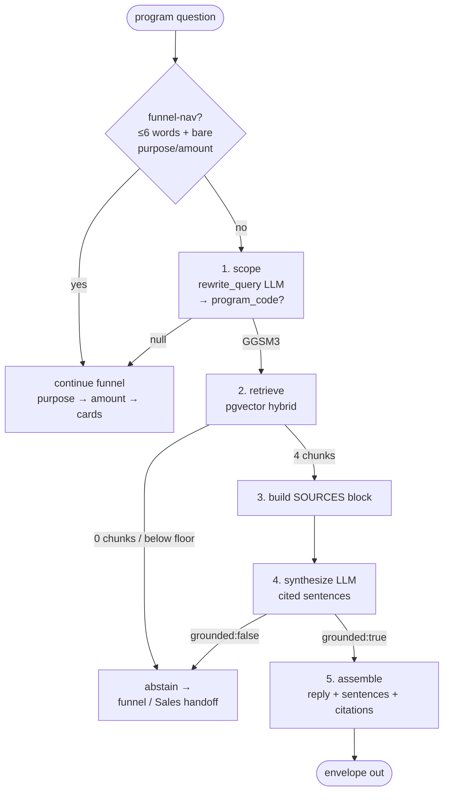

# How a grounded RAG answer is built — one question, end to end

A step-by-step walkthrough of what turns a program question into the **cited,
grounded answer** with the "Sources" panel (Phase 1). Companion to
[PIPELINE.md](./PIPELINE.md) (the whole-request graph) and
[ARCHITECTURE.md](./ARCHITECTURE.md) (design). PIPELINE.md §5 shows *where* this
runs — the `dispatch → program_advisor` box. **This file zooms into that box**:
what happens after routing decides the turn is a program question, how the four
sources are chosen, exactly what text is handed to the model, and the two prompts
that do the work.

Source of truth: `app/agents/program_advisor/advisor.py`,
`app/agents/rag/{synthesize,retriever,rewrite,corpora}.py`,
`app/integrations/vector_search.py`, `app/integrations/llm.py`,
`app/prompts/{query_rewrite,answer_synthesis}.md`, `app/config/settings.py`.

> **Status:** LIVE with `RAG_BACKEND=pgvector` against Cloud SQL `rag_chunks`.
> With `RAG_BACKEND=stub` every retrieval returns `[]` and this whole path
> short-circuits to the funnel (PIPELINE.md §11's old note). Prod runs pgvector.

---

## 0. The grounded-answer path in one picture

This runs **inside** the `ROUTE-PROGRAM` handler. Two LLM calls (rewrite, then
synthesis) bracket one deterministic retrieval. Selection is never done by the
LLM — it only reads and writes prose.



**The gate is the whole trick:** a question that *names a programme* (or the
"Details" button) gets a grounded answer; a *general* question ("what financing
do you have?") keeps running the funnel. We never silently pick one programme.

---

## 1. Entry — how we get here

Routing (PIPELINE.md §4) sent an `INS-02` (Program info) turn to
`program_advisor.handle(message, history, slots)`. The very first thing it does,
**before any funnel logic**, is check whether this is a groundable program
question ([advisor.py](../app/agents/program_advisor/advisor.py) `handle`):

```python
if not self._is_funnel_nav(message):        # not a bare "machinery" / "RM 300k"
    program = self._scoped_program(message)  # LLM: which programme is named?
    if program:
        ans = grounded_answer(self._llm, self._retriever, message,
                              Corpus.PROGRAM, top_k=4, program_code=program)
        if ans:
            return _turn(ans["reply"], ..., citations=ans["citations"],
                         sentences=ans["sentences"], grounded=True)
    # else fall through to the funnel
```

Two guards decide grounded-vs-funnel:

| Guard | Purpose | GGSM3 example |
|---|---|---|
| `_is_funnel_nav` | A ≤6-word message that's a **lone** purpose keyword or amount is funnel navigation — skip RAG so the funnel flows without an extra LLM call. | 10-word question → **not** funnel-nav → continue |
| `_scoped_program` | Does the message **name a real indexed programme**? | returns `"GGSM3"` |

> **"Details" button** = the frontend sends a message that names the programme
> (e.g. *"Tell me about GGSM3 …"*), so it lands here and produces the cited answer.

---

## 2. Step 1 — Scope the programme (LLM call #1: `rewrite_query`)

`_scoped_program` asks the model which programme is named, constrained to the
**live index's** codes (learned from the DB, not the product config — so it
survives naming drift):

```python
programs = self._retriever.programs()      # [('GGSM3','…Sales Kit'), ('MHP-I',…), …]
rw = self._llm.rewrite_query(message, programs)
code = rw.get("program_code")
return code if code in {c for c, _ in programs} else None   # drop hallucinations
```

**The prompt** (`app/prompts/query_rewrite.md`, filled with the live program list):

> You rewrite one customer message for a **retrieval** system … You do NOT answer.
> - **rewritten_query** — restate as a concise standalone search query; normalise
>   *loan→financing, interest→profit rate, borrow→finance*.
> - **program_code** — if the customer explicitly names one of the programmes
>   below, return its exact code; else `null`. **Never guess.**
> - **is_program_dependent** — true if the answer differs by programme (amount,
>   profit rate, tenure, margin, guarantee, eligibility).

Model config: `gemini-2.5-flash`, temperature 0, **structured JSON** with
`program_code` enum-constrained to the real codes (the model *cannot* emit an
invalid programme). For the GGSM3 turn it returns:

```json
{ "rewritten_query": "GGSM3 profit rate, financing amount, tenure and required documents",
  "program_code": "GGSM3", "is_program_dependent": true }
```

`program_code = "GGSM3"` ⇒ take the grounded path. `null` ⇒ fall through to the
funnel.

> **Detail — rewrite runs twice.** The advisor calls `rewrite_query` here for the
> *gate*. Then retrieval (below) calls it again inside the retriever wrapper to
> get the *rewritten query string*. Same input, temperature 0, so it's stable;
> it's a small redundancy the frozen `retrieve()` interface makes hard to avoid.

---

## 3. Step 2 — Retrieve the four sources (pgvector, deterministic)

`grounded_answer(..., top_k=4, program_code="GGSM3")`
([synthesize.py](../app/agents/rag/synthesize.py)) calls
`retriever.retrieve(message, Corpus.PROGRAM, top_k=4, program_code="GGSM3",
channel="customer")`. Two wrappers run in order:

### 3a. `RewriteScopingRetriever` (query rewrite + scope) — `rag/rewrite.py`
Rewrites the query string and applies the programme scope, then delegates:
```python
rw = self._llm.rewrite_query(query, programs)
rewritten = rw["rewritten_query"] or query
pc = program_code or (rw["program_code"] if rw["program_code"] in valid else None)
return self._inner.retrieve(rewritten, corpus, top_k, program_code=pc, channel=channel)
```
Caller's explicit `program_code` (GGSM3) wins; an inferred code is used only if
it's a real indexed code (hallucinated codes are dropped → unscoped).

### 3b. `PgVectorRetriever` (the real search) — `integrations/vector_search.py`
Six sub-steps:

1. **Embed the query** — `gemini-embedding-001`, task `RETRIEVAL_QUERY`,
   `output_dimensionality=1536`, then **L2-normalised**. This *must* match how the
   documents were embedded at ingest (`RETRIEVAL_DOCUMENT`, 1536) or cosine is
   meaningless.
2. **Build the SQL filter** (mandatory, non-negotiable boundaries):
   ```
   corpus = ANY(['program'])
   AND (expiry_date IS NULL OR expiry_date >= CURRENT_DATE)   -- freshness
   AND access_tier = 'customer'    -- §11 tier boundary (customer channel)
   AND needs_review = false        -- verification-quarantined pages excluded
   AND program_code = 'GGSM3'      -- §6a program scope
   ```
   The model therefore *physically* only ever sees GGSM3 customer-safe pages.
3. **Two searches** over the filtered rows:
   - **Dense / semantic** — `ORDER BY embedding <=> queryvec` via the **HNSW**
     index, `LIMIT 20` (`RAG_HYBRID_CANDIDATES`). Each row also returns
     `1 - (embedding <=> queryvec)` as its **cosine** score.
   - **Keyword / lexical** — `content_tsv @@ plainto_tsquery('english', q)`
     via the **GIN** index, ranked by `ts_rank`, `LIMIT 20`.
4. **Fuse with Reciprocal Rank Fusion** — `score[id] += 1 / (60 + rank)` summed
   across both legs (`RAG_RRF_K=60`). No score-weight tuning; a page strong in
   *both* legs rises. (RRF, not raw cosine, sets the final order.)
5. **Relevance floor** — if the **best cosine** across all rows `< 0.58`
   (`RAG_RELEVANCE_FLOOR`), return `[]`. This is honest abstention: out-of-corpus
   questions score ~0.50 and get nothing rather than a forced answer.
6. **Return the top `top_k=4`** by RRF as `RetrievalChunk`s
   `{text, corpus, ref, score=cosine, metadata{doc_title, section, page, …}}`.

For GGSM3 the floor passes (best 0.77) and the four returned chunks are exactly
the "Sources" you see:

| # (1-based) | doc_title | section | page | cosine |
|---|---|---|---|---|
| 1 | GGSM3 Sales Kit | Financing rate | 5 | 0.77 |
| 2 | GGSM3 Sales Kit | Documents | 6 | 0.76 |
| 3 | GGSM3 Sales Kit | Overview | 1 | 0.76 |
| 4 | GGSM3 Sales Kit | Guarantee | 4 | 0.71 |

> If retrieval returns `[]` (nothing indexed, or everything below the floor),
> `grounded_answer` returns `None` and the advisor falls through to the funnel /
> Sales handoff. The bot never fabricates to fill a gap.

---

## 4. Step 3 — Build the context handed to the model

This is the exact "what gets passed as context" answer. The four chunks become a
**numbered SOURCES block** — `[n] (doc_title · section)` then the **full chunk
text** — joined by blank lines ([llm.py](../app/integrations/llm.py)
`synthesize_answer`):

```python
listing = "\n\n".join(f"[{i}] ({doc_title} · {section})\n{chunk_text}"
                      for i, c in enumerate(chunks, start=1))
```

Rendered for GGSM3 (abridged — the real text is each page's full body):

```
[1] (Government Guarantee Scheme Madani 3 (GGSM3) Sales Kit · Financing rate)
Profit rate: BFR + 2% per annum. Current BFR 6.56% … <full page 5 text>

[2] (Government Guarantee Scheme Madani 3 (GGSM3) Sales Kit · Documents)
Required documents: business registration; financial statements; bank
statements; debtors/creditors ageing report; … <full page 6 text>

[3] (Government Guarantee Scheme Madani 3 (GGSM3) Sales Kit · Overview)
Financing size up to RM 10.0 million per company (all sectors); tenure up to
5 years … <full page 1 text>

[4] (Government Guarantee Scheme Madani 3 (GGSM3) Sales Kit · Guarantee)
Guarantee cover … <full page 4 text>
```

That block, plus the customer's question, is the **only** knowledge the model may
use. No history, no other programmes, no general knowledge.

---

## 5. Step 4 — Synthesise the cited answer (LLM call #2: `synthesize_answer`)

**The prompt** (`app/prompts/answer_synthesis.md`, filled with `{query}` +
the SOURCES block above):

> You answer using ONLY the numbered sources … every claim must trace to a source.
> - Use **only** the SOURCES. Never guess or fill from general knowledge.
> - Split the answer into **sentences**. Each sentence carries `cites` — the
>   1-based numbers of the source(s) that support it. A sentence with no
>   supporting source must not be written.
> - Concise (1–4 sentences). *financing* not loan, *profit rate* not interest.
>   Preserve figures exactly.
> - If the sources do not answer, return `{"grounded": false, "sentences": []}`.

Model config: `gemini-2.5-flash`, temperature 0, **structured JSON** forced to
`{grounded: bool, sentences: [{text, cites:[int]}]}`. The system instruction is
`response_style.md` + this prompt. It returns:

```json
{ "grounded": true,
  "sentences": [
    {"text": "The profit rate for GGSM3 is from BFR + 2% per annum, with the current BFR at 6.56%.", "cites": [1,3]},
    {"text": "The financing size per SME for GGSM3 is up to RM 10.0 million per company for all sectors, with a financing tenure of up to 5 years.", "cites": [1,3]},
    {"text": "Required documents include business registration, financial statements, bank statements, debtors/creditors ageing report, photocopies of identity cards of directors/owners/partners, and a consent form to check credit records.", "cites": [2]}
  ] }
```

**Two safety rails in code after the model returns:**
- **Cites are clamped to range** — any number not in `1..4` is dropped, so the
  model cannot invent a source `[5]`.
- **`grounded` is ANDed with "has sentences"** — no valid sentences ⇒
  `grounded=false` ⇒ caller abstains.

If Vertex is unavailable, the **stub** `synthesize_answer` runs instead: it
surfaces a lead sentence from the top 2 chunks, each citing itself — enough to
render the chips + Sources offline (no fabrication, just no real prose).

---

## 6. Step 5 — Assemble the envelope

[synthesize.py](../app/agents/rag/synthesize.py) `grounded_answer` finishes:

```python
citations = [_citation(i, c) for i, c in enumerate(chunks, start=1)]  # 1-based
reply = " ".join(s["text"] for s in sentences)
return {"reply": reply, "sentences": sentences, "citations": citations, "grounded": True}
```

- **`reply`** — the sentences joined (the plain text, for any client that ignores
  citations).
- **`sentences`** — `[{text, cites}]` — drives the **inline chips**.
- **`citations`** — one per chunk, each `{n, doc_title, section, page, ref,
  snippet, score, access_tier, …}` — drives the **Sources** list. `page` is
  parsed from the `#page=N` in the source URI; `score` is the cosine.

The advisor wraps this in a `_turn(..., stage="program_offer",
ui_action=none, grounded=True)`. The orchestrator's `dispatch` node folds it into
the response.

### The next-step offer (so the answer doesn't dead-end)
A grounded answer is not a conversational dead-end: the advisor **remembers the
programme** (`slots["last_program"] = "GGSM3"`) and appends a call-to-action
sentence (no citation) — *"Would you like to apply for GGSM3, or speak with our
SME team?"* — and sets `stage = program_offer`. On the next turn, a bare reply is
read as **proceed / decline** instead of being re-classified (which would read
*"sounds good"* as a goodbye): `STAGE_TO_ROUTE["program_offer"] → ROUTE-PROGRAM`
continues in the advisor, which interprets *"yes / sounds good / apply"* →
open the application form **for GGSM3**, *"no thanks"* → graceful close. An
explicit *"talk to a person"* still routes to Sales via the classifier (INS-01).

> **The bug that was here:** `sentences` and `grounded` were not declared as
> LangGraph state channels in `orchestrator/state.py`, so the graph **dropped
> them** before the response was assembled — `citations` survived, the chips and
> `grounded` flag did not. Fixed by declaring both channels.

---

## 7. Step 6 — The frontend renders it

`ChatPanel.jsx` → `GroundedAnswer({ sentences, citations })`:
- renders each sentence, appending its `cites` as little `①③` chips inline;
- lists `citations` under **Sources** as `section · p.N · cos 0.NN`;
- a chip / row is clickable (Phase 2 will open the real document page here).

That is exactly the screenshot: three sentences with `①③ / ①③ / ②` chips and the
four-row Sources panel.

---

## 8. The envelope additions (vs. a plain turn)

The grounded path adds three fields on top of the normal `ChatResponse`
(PIPELINE.md §7):

| Field | Contents | Drives |
|---|---|---|
| `grounded` | `true` on a cited RAG answer | UI switches to `GroundedAnswer` |
| `sentences` | `[{text, cites:[int]}]` | inline citation chips |
| `citations` | `[{n, corpus, ref, snippet, doc_id, doc_title, section, page, score, access_tier}]` | the Sources list |

`ui_action` is `none` (the answer is text, not a card), `stage` is
`program_offer` (so the next turn's *"yes / no"* continues the offer).

---

## 9. Config knobs (all env-driven — `settings.py`)

| Env var | Default | Role |
|---|---|---|
| `RAG_BACKEND` | `stub` | `pgvector` to go live; `stub` returns `[]` (funnel everywhere) |
| `EMBEDDING_MODEL_ID` | `gemini-embedding-001` | query embedder — **must match ingest** |
| `EMBEDDING_DIMENSIONS` | `1536` | vector width — **must match ingest** |
| `RAG_HYBRID_CANDIDATES` | `20` | rows per leg (dense, keyword) before fusion |
| `RAG_RRF_K` | `60` | RRF constant `1/(k+rank)` |
| `RAG_RELEVANCE_FLOOR` | `0.58` | best cosine below this ⇒ abstain (`[]`) |
| `top_k` | `4` (caller) | final chunks returned — the advisor passes 4 |

`DB_HOST/DB_PORT/DB_NAME/DB_USER/DB_PASS` point the retriever at Cloud SQL
(`rag_chunks`). Prod uses the Cloud SQL unix socket (`DB_HOST=/cloudsql/…`).

---

## 10. Worked examples

**"Tell me about GGSM3 — profit rate, amount, tenure, documents."** (the screenshot)
→ not funnel-nav → `_scoped_program` → `GGSM3` → retrieve 4 chunks (best cos 0.77)
→ SOURCES block → synthesis `grounded:true`, 3 sentences → chips + Sources + the
CTA *"Would you like to apply for GGSM3…?"*. `stage=program_offer`,
`last_program=GGSM3`.

**…then "ok sounds good to me"** → classified SOC-03, but `program_offer`
continuation keeps it in the advisor → read as **apply** →
`open_application_link` for GGSM3 ("Great — let's get your application for GGSM3
started."). *(Before this fix it was read as a goodbye → R11 sign-off.)*

**"What SME financing do you offer?"** → not funnel-nav, but `_scoped_program`
returns `null` (no programme named) → **funnel** (purpose → amount → matched
cards). No RAG answer — we never pick one programme for the customer.

**"machinery"** (mid-funnel) → `_is_funnel_nav` true (≤6 words, a purpose
keyword) → skip RAG, continue the funnel with that purpose. Keeps the funnel
snappy and avoids a needless rewrite call.

**"What's the profit rate for GGSM3?"** but the DB is empty / below floor →
retrieve returns `[]` → `grounded_answer` → `None` → advisor falls through to the
funnel / Sales handoff. The bot abstains instead of guessing.

**Guidelines / Shariah question** (`ROUTE-GUIDELINES`) → the `guidelines` agent
uses the **same** `grounded_answer` helper over `Corpus.GUIDELINES_SHARIAH`.
That corpus is still empty pending BMMB docs, so it abstains today.

---

## 11. Notes & current limits

- **Branch B (anaphora) is not resolved.** `rewrite_query` sees only the current
  message — "what about *that* one?" yields `program_code=null` (no session
  context reaches the frozen `retrieve()` interface). The customer must name the
  programme, or the funnel handles it. See ARCHITECTURE §6a.
- **Rewrite runs twice** per grounded program answer (gate + retriever wrapper) —
  stable at temperature 0, but a known small redundancy.
- **Internal criteria never leak.** `access_tier='customer'` + `needs_review=false`
  are enforced in SQL, not in the prompt — an internal-only page can't be
  retrieved on the customer channel even if the query matches it.
- **Chunk text is data, not instructions** — the SOURCES block is delimited and
  the prompt forbids following anything inside it.
